# **Finding Lane Lines on the Road**

## Writeup Template

### You can use this file as a template for your writeup if you want to submit it as a markdown file. But feel free to use some other method and submit a pdf if you prefer.

---

**Finding Lane Lines on the Road**

The goals / steps of this project are the following:
* Make a pipeline that finds lane lines on the road
* Reflect on your work in a written report

---

### Reflection

### 1. Describe your pipeline. As part of the description, explain how you modified the draw_lines() function.

My pipeline consists of 6 steps.

* Convert image to grayscale
* Apply a gaussian blur with a radius of 5
* Run the image though the Canny filter to find all edges, i found setting a low_threshold of 50 and a high_threshold of 150 worked fine.

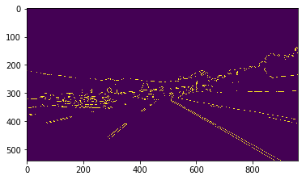
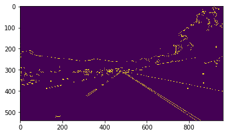

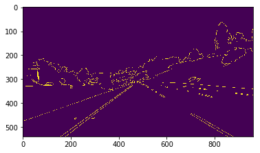
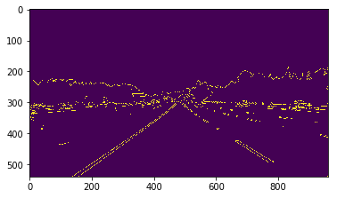

* Mask the image to remove the areas we don't care about. The region is chose to capture was a trapezoid shape, the bottom of which spanned the full iamge and the top about half way up the image with 50px width. This seemed to capture all the lines pretty well.

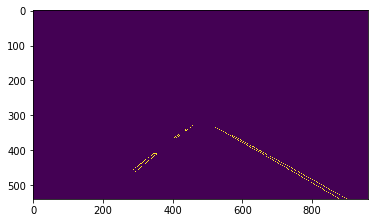
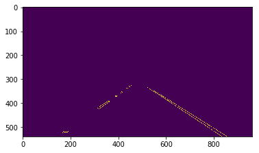
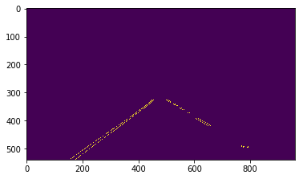
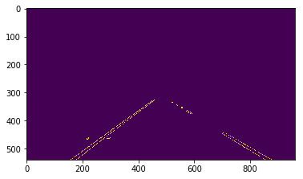

* Next i do a hough transform that connects lines i'm interested in. The hough filter takes 5 paramaters, there was a lot of trial and error here trying to find the optional values.

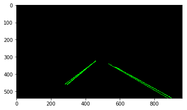
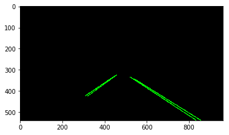
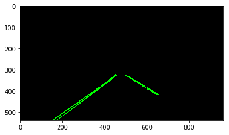
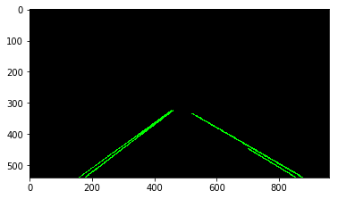
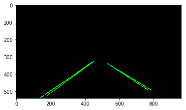
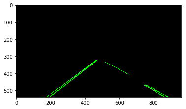

* Finally return the weighted image with my hough lines draw on the original image.

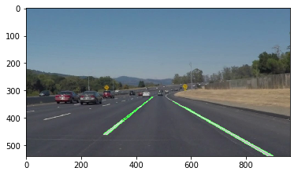

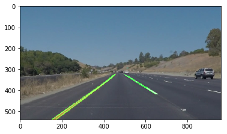
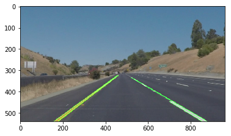
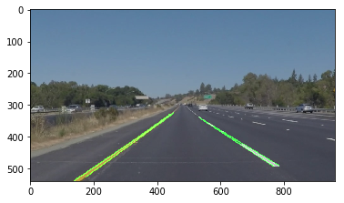
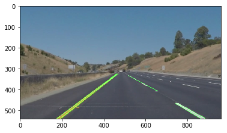

I modified the draw_lines method by first separating and collecting all the points depending on positive or negative slope.

Next i have a method to extrapolate the line based on our Xs and Ys. I average out all collected data points and determine the average slope. The max_y and min_y will always be the image height and the top of our region respectively (this is to ensure our lines stay within the area of interest). Finally after determining our Xs we can draw the line.

This looks pretty good. Time to move onto the videos.

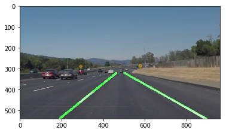
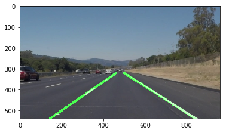
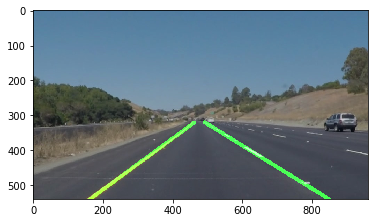
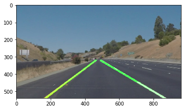
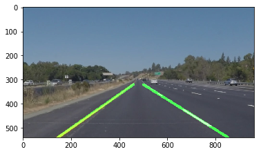
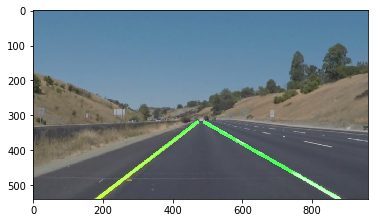

The video successfully detects the lines for the most part. However at around the 11 second mark, there's a few frames where the right lanes messes up.

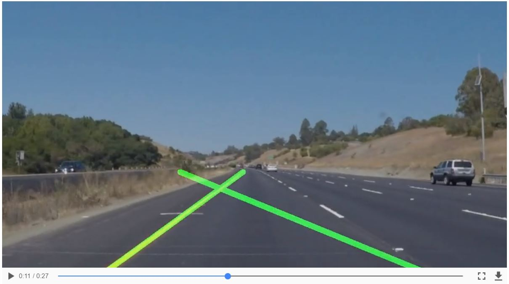

My solution doesnt work well on the challenge at all.

### 2. Identify potential shortcomings with your current pipeline

A shortcoming could be when driving in poor light, or moving in/ out of different lighting/ shade (for example a tunnel). It's also not great with curves.

### 3. Suggest possible improvements to your pipeline

I could keep tweaking the hough/ canny parameters using some frames from the video where it failed to correctly detect the lines.

The mask region is also always fixed, if lanes do not fall within our area intrest (like a really sharp turn) we might fail to detect. Having some kind of dynamic frame may help.
